## 登录
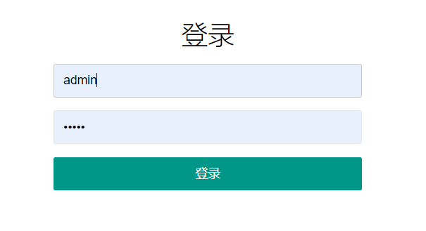

## 主机
### 主机添加
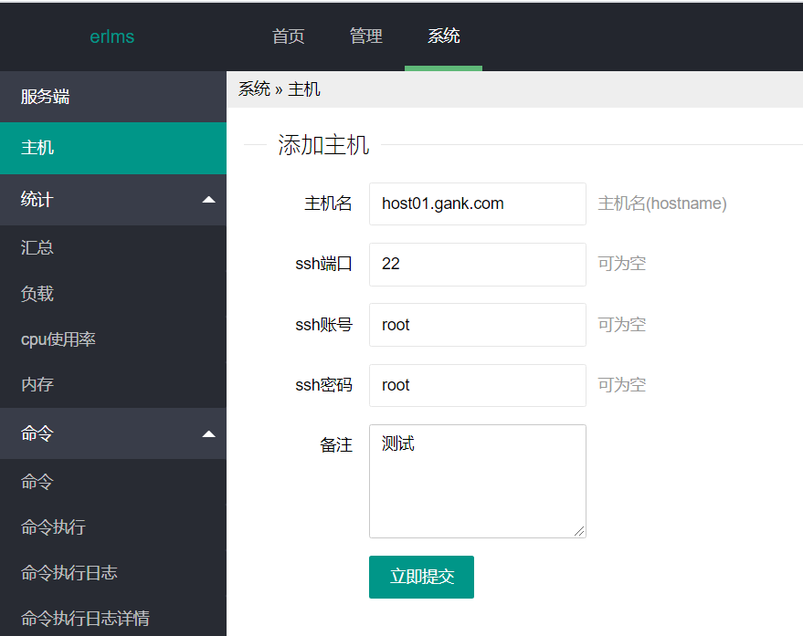
### 主机列表-离线
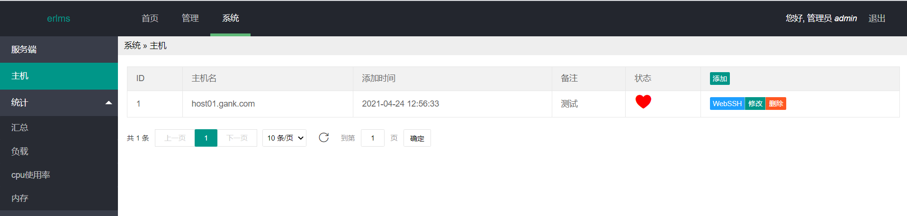
### 主机列表-在线
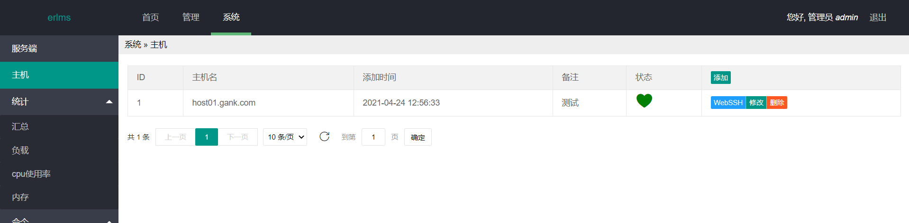
### 主机webssh
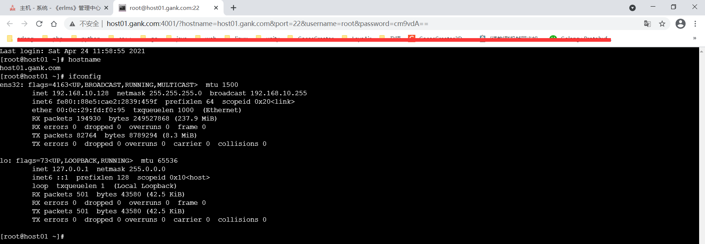

## 统计
### 统计负载
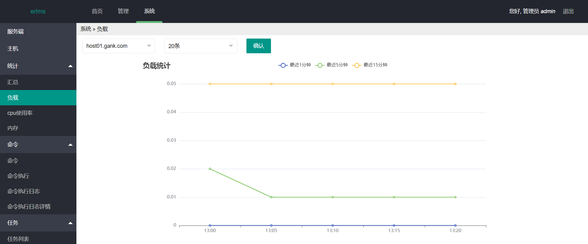
### 统计cpu使用率
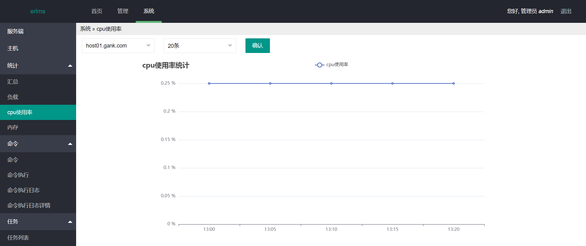
### 统计内存
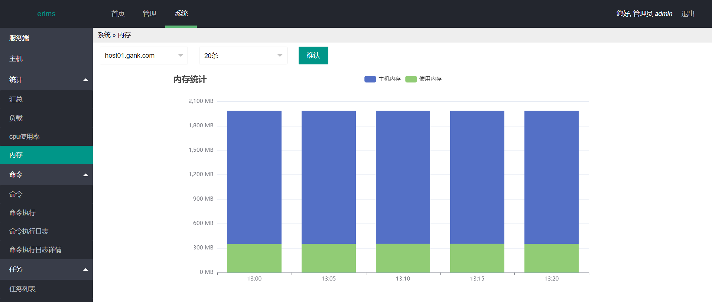
### 统计汇总
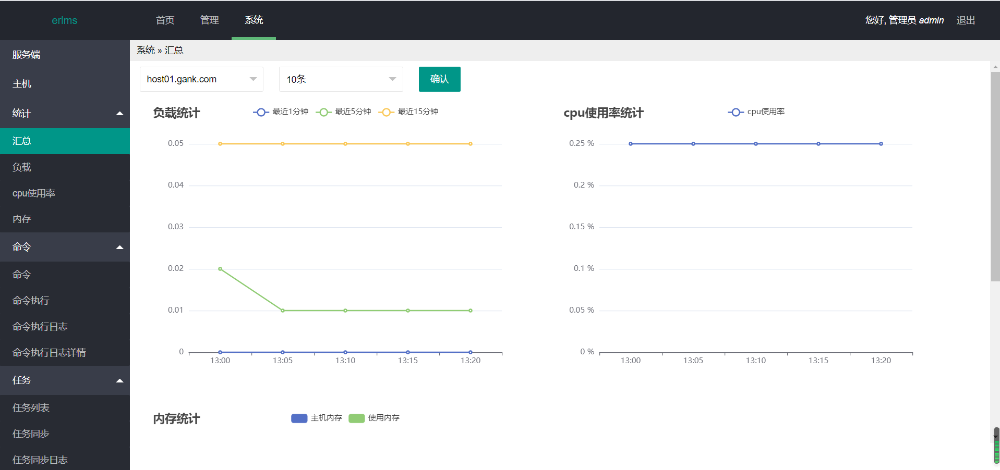

## 命令
### 命令添加
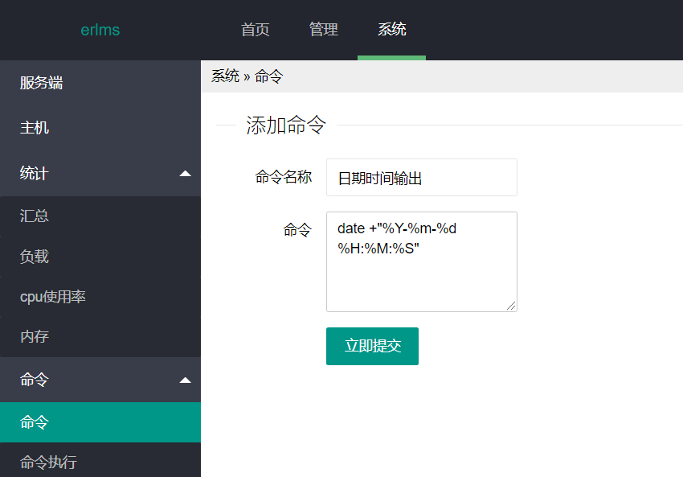
### 命令列表
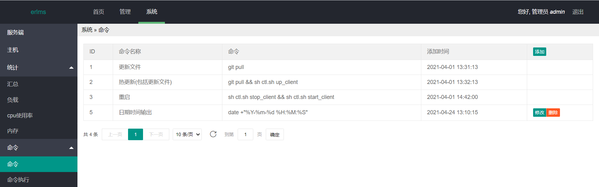
### 命令执行
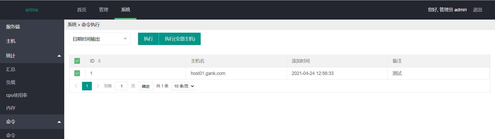
### 命令执行日志
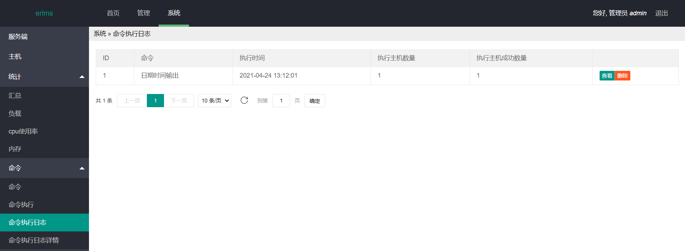
### 命令执行日志详情
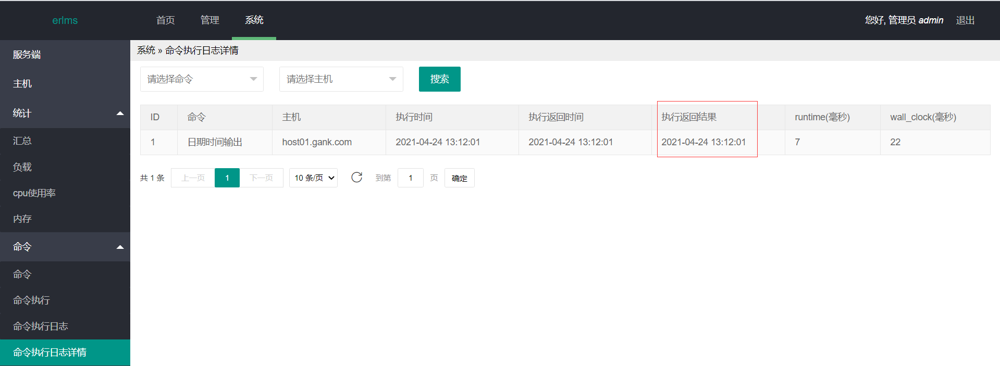

## 任务
### 任务添加
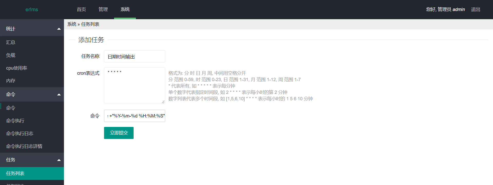
### 任务列表
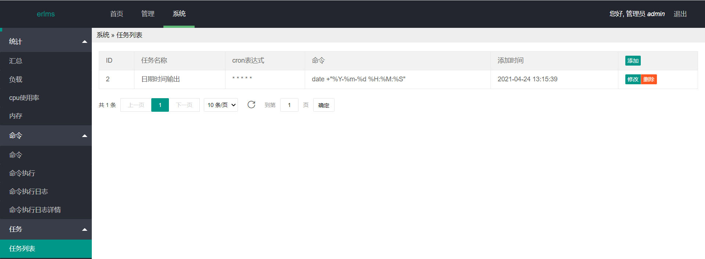
### 任务同步
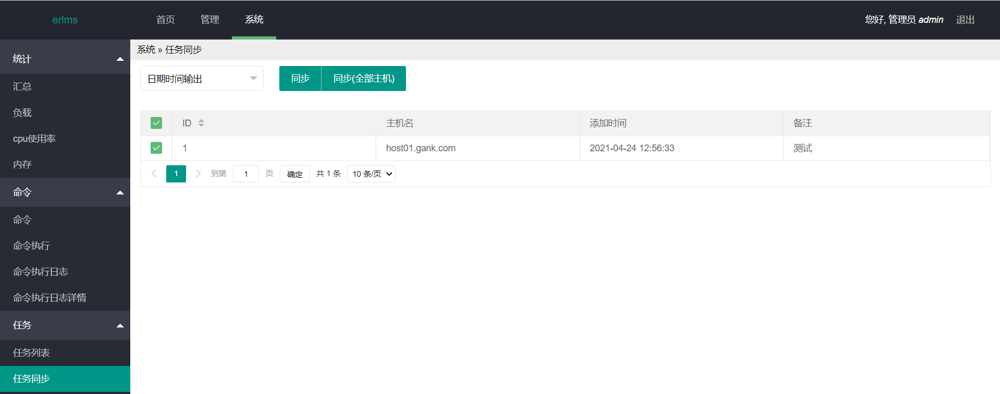
### 任务同步日志
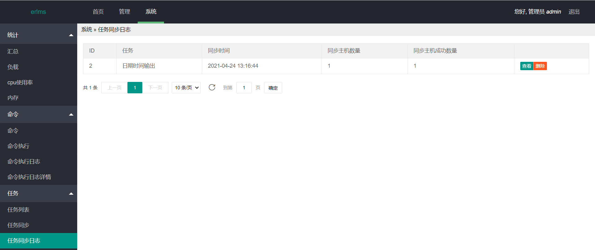
### 任务同步日志详情
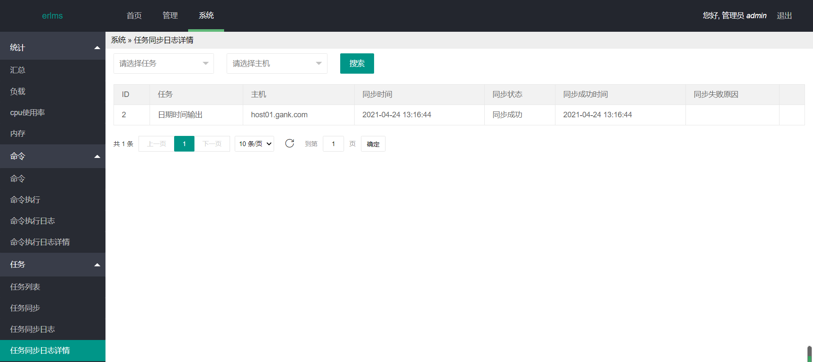
### 任务执行日志
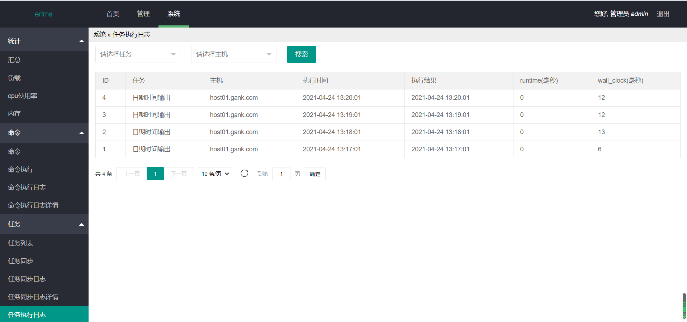
